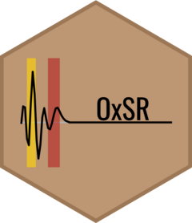

# Overview  <a href="https://fgu5tav0.github.io/OxSR/"></a>

<!-- badges: start -->
&nbsp; 
&nbsp;
&nbsp; 
<!-- badges: end -->

The OxSR package calculates the ratio between hematite and goethite oxides in soil via diffuse reflectance.

In soil science, understanding the mineral composition is often a starting point for research in various areas.

Iron oxides are widely studied and play a role in a range of studies, from fertilization and nutrient dynamics to contamination and sustainable practices.

Techniques for determining these minerals are often expensive and time-consuming. Therefore, practical, rapid, and sensitive methods such as diffuse reflectance in the visible spectrum have gained importance. This technique can also be used to determine soil color, another parameter that helps in understanding the environment.

## Installation

```r
install.packages("OxSR")
```

```r
library(OxSR)
```
